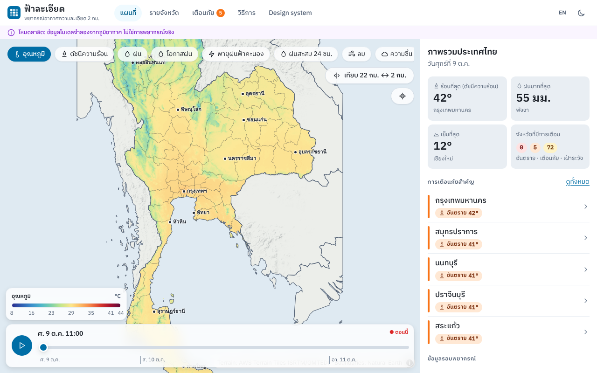
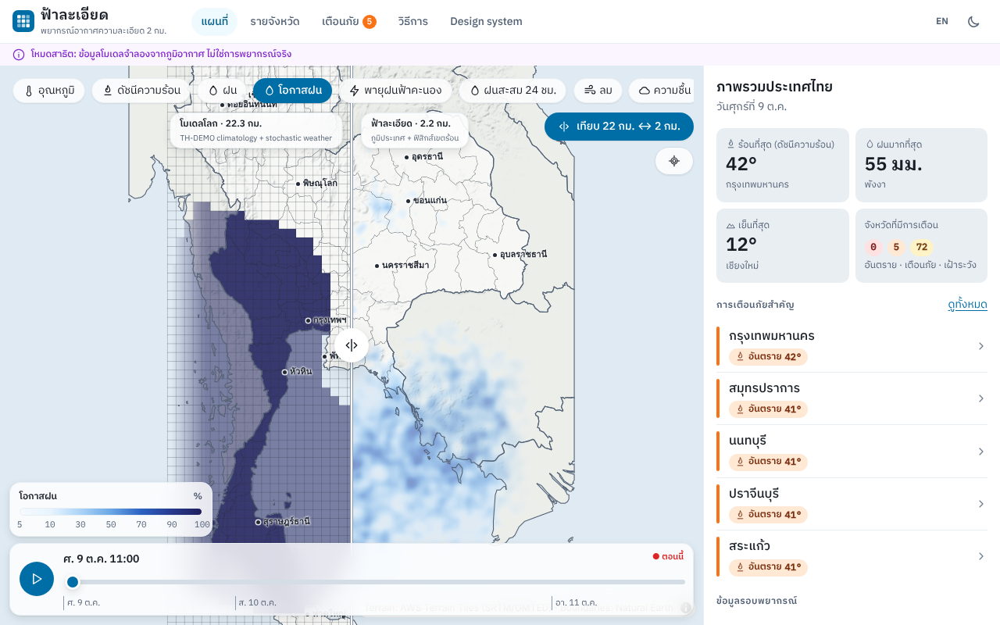
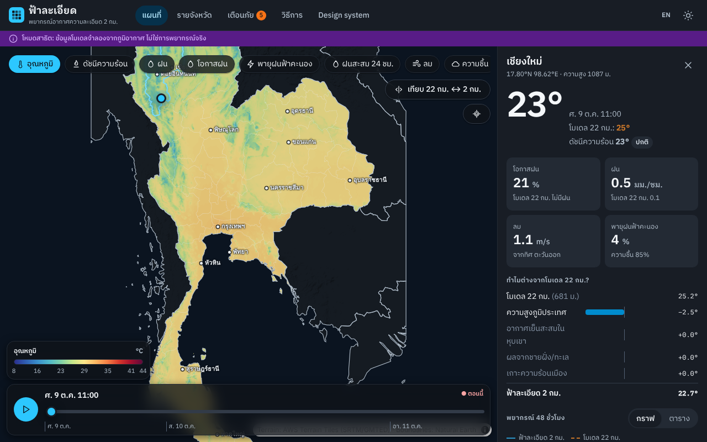
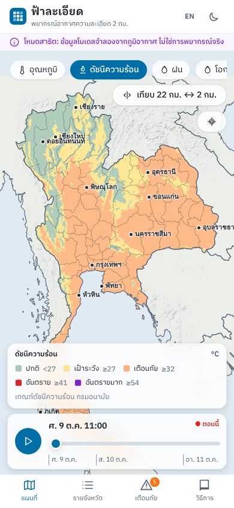

# Design & design system / การออกแบบและระบบดีไซน์

Live showcase: open the app → **Design system** (`/design`).

## Users and context

| Who | Needs | Implication |
|---|---|---|
| ประชาชนทั่วไป (mobile, outdoors, often slow data) | "Will it rain *here* this afternoon? Is it dangerously hot?" | Thai first, glanceable hero number, bottom navigation, 1 byte/cell map data |
| Farmers / outdoor workers | Rain chance and heat over the next 2 days | 48 h timeline, chance of rain instead of false precision, heat-index levels |
| Local government / disaster offices | Which provinces need attention | Alerts page sorted by severity, province table, TMD vocabulary |
| Meteorologists / researchers | What the system changed and why | 22 km ↔ 2 km swipe, per-process temperature breakdown, open API |

## Principles

1. **ไทยมาก่อน (Thai first)** – Thai copy is primary; Thai script needs line-height ≥ 1.6 (stacked vowels and tone marks), IBM Plex Sans Thai; TMD terms ("ฝนเป็นแห่งๆ", "อากาศร้อนจัด").
2. **Warnings first** – alert-tier colours (เหลือง / ส้ม / แดง, see [ALERTS.md](ALERTS.md)) are reserved for alerts and always paired with an icon and a text label.
3. **Honest uncertainty** – tropical rain is expressed as chance (%) and % of area, never as a single exact point value.
4. **Always comparable** – any number can be compared with the 22 km model: blue solid = 2 km, orange dashed = 22 km (validated CVD-safe in both themes).
5. **Mobile & low bandwidth** – 44 px touch targets, map frames ≈ 80 KB, no third-party map tiles.
6. **Accessible** – WCAG AA text contrast, table alternative to every chart, keyboard-operable slider/compare handle, `prefers-reduced-motion`.

## Token architecture

```
design-system/tokens/
  primitive.json   raw palettes (monsoon, cloud, rice, mango, papaya, chili, orchid),
                   font families/sizes/line-heights, space, radius, duration, easing, z-index
  semantic.json    roles with light value + dark override ($extensions["th.weather.modes"].dark):
                   color.bg|fg|border|accent|status|severity|map|chart, shadow, typography
  weather.json     scales (temperature, heatIndex, humidity, rainRate, rainDaily,
                   probability, thunder, wind, cloud) + categories with thresholds
```

`node design-system/scripts/build-tokens.mjs` (zero dependencies) resolves
references and writes:

| Output | Consumer |
|---|---|
| `dist/tokens.css` → `frontend/src/design/generated/tokens.css` | CSS custom properties, `:root` light, `[data-theme=dark]` + `prefers-color-scheme` dark, `.text-*` typography classes |
| `dist/tokens.ts` → `frontend/src/design/generated/tokens.ts` | typed `tokens`, `cssVar()`, `weatherScales` |
| `dist/weather-scales.json` → `backend/app/data/weather_scales.json` | alert thresholds and legends served by the API |
| `dist/tokens.json` | flat resolved values (for Figma/Tokens Studio import) |

CI runs `build-tokens.mjs --check` so generated files never drift.

### Rules

- Components use **semantic** tokens only (`var(--color-bg-surface)`), never primitives or hex.
- New colour → add a primitive step, then map a semantic role for both modes.
- New weather threshold → edit `weather.json` only; backend alerts and web legends update together.
- Map colours are tokens too (`color.map.*`), so the self-hosted basemap follows the theme.

## Colour scales

| Scale | Type | Notes |
|---|---|---|
| temperature | continuous, 8–44 °C | cool blues → comfort greens → hot reds; lightness ordered |
| heatIndex | stepped | Department of Health levels 27 / 32 / 41 / 54 °C |
| rainRate | continuous, √-spaced legend | radar convention; < 0.1 mm/h transparent |
| rainDaily | continuous | breakpoints at TMD terms 10 / 35 / 90 mm |
| probability / thunder / wind / humidity / cloud | continuous | single-hue or Beaufort-anchored |

Weather-map ramps are multi-hue by domain convention (users read radar and
temperature maps this way); chart series colours follow the categorical
validation rules instead.

## Key screens

| Screen | Content |
|---|---|
| Map (`/`, shareable `/?lat=&lon=`) | layer chips, swipe compare 22 km ↔ 2 km, legend, 48 h timeline with play, hover read-out, national overview sidebar or point panel (bottom sheet on mobile) |
| Point panel | hero temperature vs model, heat-index level, chance of rain, "why it differs" waterfall, 48 h charts / table, daily rain |
| Provinces (`/provinces`, `/provinces/<slug>`) | searchable table by region and day; a server-rendered page per province with auto-generated TMD-style forecast text (also used as the SEO description) and hourly charts |
| Alerts (`/alerts`) | grouped by day and severity, thresholds explained |
| Method (`/method`) | the 22 km problem illustrated, pipeline, limitations, data sources |
| Design system (`/design`) | principles, every token, scales, thresholds, components |

## Screenshots

| | |
|---|---|
|  |  |
|  |  |
